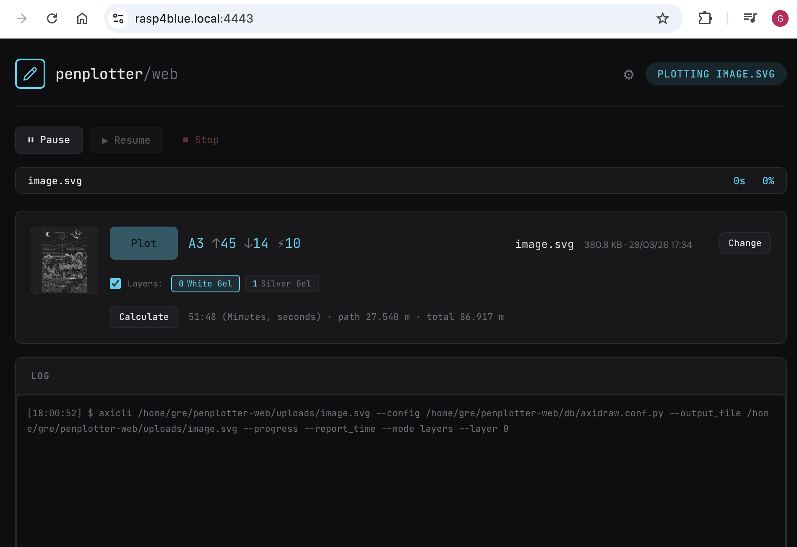
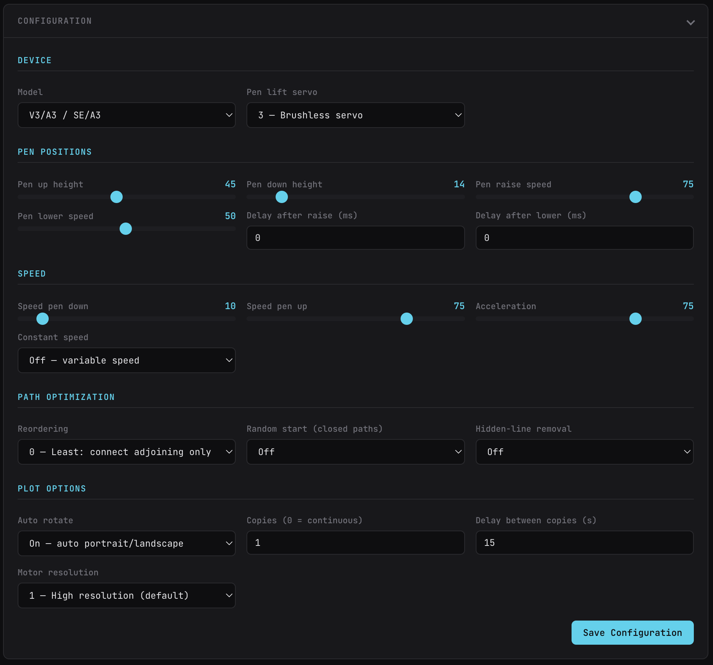

# penplotter/web

Web interface for controlling an AxiDraw pen plotter from a Raspberry Pi.




## Setup

```bash
./run.sh          # HTTPS on port 4443
```

Or as a systemd service:

```bash
# Edit penplotter-web.service.example with your user/paths, then:
cp docs/penplotter-web.service.example penplotter-web.service
sudo cp penplotter-web.service /etc/systemd/system/
sudo systemctl daemon-reload
sudo systemctl enable --now penplotter-web
```

Access at `https://<your-hostname>:4443`

## Features

- Upload, select, preview SVG files
- Plot with layer mode support (Inkscape layers)
- Pause / Resume / Stop with Home return
- Pen up/down, XY move controls
- Estimate plot time before starting
- Live progress with ETA
- Configuration UI (model, pen positions, speed, path optimization)
- Web notifications on plot complete/pause/error
- Real-time log with SSE

## Requirements

- Python 3.9+
- `axicli` installed and in PATH
- AxiDraw connected via USB

## Disclaimer

This software is provided as-is. Use at your own risk. The author is not responsible for any damage to your hardware, artwork, or anything else resulting from the use of this software. See [LICENSE](LICENSE).

